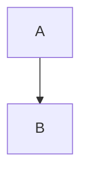

# Boostnote Legacy - 技術参考資料

## 概要

Boostnote Legacyは、プログラマー向けに設計されたElectronベースのノート管理アプリケーションです。React 16.8、Redux、CSS Modulesで構築されており、強力なマークダウンエディターとコードスニペットサポートを提供します。この文書は、アーキテクチャを理解し、現代的な代替案を実装するための包括的な技術参考資料として機能します。

## アーキテクチャ概要

### 技術スタック
- **フロントエンドフレームワーク**: React 16.8 + Redux
- **デスクトップランタイム**: Electron 4.2.12
- **ビルドシステム**: Webpack 1.x + Grunt
- **スタイリング**: CSS Modules with Stylus
- **テスト**: Jest (コンポーネント) + AVA (データレイヤー)
- **Node.js**: 14.21.3 (Electron互換性のために必要)

### アプリケーション構造
```
browser/                 # フロントエンドReactアプリケーション
├── components/          # 再利用可能なReactコンポーネント
├── main/               # コアアプリケーションコンポーネント
│   ├── Detail/         # ノート詳細/エディタービュー
│   ├── NoteList/       # ノートリストビュー
│   ├── SideNav/        # ナビゲーションサイドバー
│   └── modals/         # モーダルダイアログ
├── lib/                # ユーティリティライブラリとヘルパー
└── styles/             # グローバルスタイルとテーマ

lib/                    # Electronメインプロセス
└── main-app.js         # メインアプリケーションエントリーポイント

locales/                # 国際化ファイル
resources/              # 静的アセットとアイコン
tests/                  # テストファイル
```

## 主要機能

### 1. ノートタイプ
- **マークダウンノート**: マークダウン記法をサポートするリッチテキストノート
- **スニペットノート**: 複数言語の構文ハイライト機能付きコードスニペット

### 2. ストレージシステム
- **ローカルファイルストレージ**: ノートはローカルディレクトリにCSONファイルとして保存
- **複数ストレージ**: 複数のストレージロケーションをサポート
- **フォルダ構成**: ストレージ内の階層フォルダ構造

### 3. エディター機能
- **デュアルペインエディター**: マークダウンエディターとライブプレビューの分割表示
- **構文ハイライト**: 100以上の言語モードを持つCodeMirrorベースのエディター
- **ライブプレビュー**: カスタム拡張によるリアルタイムマークダウンレンダリング
- **添付ファイルサポート**: 画像とファイル添付の管理

### 4. 高度なマークダウンサポート
- **拡張構文**: テーブル、タスクリスト、数式（KaTeX）
- **図表**: Mermaid、PlantUML、Flowchart.js、シーケンス図
- **コードブロック**: 行番号付き構文ハイライト
- **目次**: `[TOC]`マーカーによる自動生成目次

## データモデル

### ノート構造
```javascript
{
  key: "unique-note-id",
  type: "MARKDOWN_NOTE" | "SNIPPET_NOTE", 
  title: "ノートタイトル",
  content: "ノート内容...",
  tags: ["tag1", "tag2"],
  folder: "folder-key",
  storage: "storage-key",
  isStarred: false,
  isTrashed: false,
  isPinned: false,
  createdAt: Date,
  updatedAt: Date,
  linesHighlighted: [1, 5, 10], // コードハイライト用
  
  // スニペットノートのみ
  snippets: [{
    name: "snippet-name",
    mode: "javascript",
    content: "code...",
    linesHighlighted: []
  }],
  description: "スニペットの説明",
  
  // マークダウンノートのみ
  blog: {
    blogLink: "https://...",
    blogId: "post-id"
  }
}
```

### ストレージ構造
```javascript
{
  key: "storage-key",
  name: "ストレージ名",
  path: "/path/to/storage",
  folders: [{
    key: "folder-key", 
    name: "フォルダ名",
    color: "#hexcolor"
  }],
  isOpen: true // UI状態用
}
```

### Redux状態構造
```javascript
{
  data: {
    storageMap: Map<key, storage>,
    noteMap: Map<key, note>,
    starredSet: Set<noteKey>,
    trashedSet: Set<noteKey>,
    storageNoteMap: Map<storageKey, Set<noteKey>>,
    folderNoteMap: Map<folderKey, Set<noteKey>>,
    tagNoteMap: Map<tag, Set<noteKey>>
  },
  config: { /* ユーザー設定 */ },
  status: { updateReady: false },
  router: { /* ルーティング状態 */ }
}
```

## 主要コンポーネント

### 1. Detailコンポーネント (`browser/main/Detail/index.js`)
**目的**: メインノート編集インターフェース
**機能**:
- クエリパラメータによるルートベースのノート選択
- マークダウンvsスニペットノートの条件付きレンダリング
- 検索とフィルター機能の統合
- 空の状態のハンドリング

### 2. NoteListコンポーネント (`browser/main/NoteList/index.js`)
**目的**: ノートの一覧表示と管理
**主要機能**:
- 複数のソートオプション（作成日、更新日、アルファベット順）
- キーボードナビゲーション（j/k、矢印キー）
- Ctrl/Shiftによる複数選択
- ドラッグアンドドロップサポート
- ノート操作用コンテキストメニュー
- インポート/エクスポート機能
- リアルタイム検索フィルタリング

### 3. SideNavコンポーネント (`browser/main/SideNav/index.js`)
**目的**: ナビゲーションと整理
**機能**:
- ストレージとフォルダの管理
- フィルタリング機能付きタグベースナビゲーション
- 折りたたみ可能なフォルダビュー
- タグの色カスタマイズ
- タグ/フォルダの検索機能

### 4. MarkdownEditorコンポーネント (`browser/components/MarkdownEditor.js`)
**目的**: ライブプレビュー付きマークダウン編集
**機能**:
- デュアルペイン編集（コード + プレビュー）
- 複数のスイッチモード（ブラー、ダブルクリック、右クリック）
- プレビューでのチェックボックス操作
- ドラッグドロップ画像処理
- スマートペースト機能

### 5. CodeEditorコンポーネント (`browser/components/CodeEditor.js`)
**目的**: CodeMirrorを使った高度なコード編集
**機能**:
- 100以上の構文ハイライトモード
- Vim/Emacsキーバインディング
- スマートカーソル付きテーブル編集
- スニペット展開
- 行ハイライト
- オートコンプリートとブラケットマッチング

## データレイヤー

### API構造 (`browser/main/lib/dataApi/`)
```javascript
// コア操作
createNote(storageKey, noteData)
updateNote(storageKey, noteKey, noteData)
deleteNote(storageKey, noteKey)
moveNote(originNote, targetStorage, targetFolder)

// ストレージ管理
addStorage(path)
removeStorage(storageKey)
renameStorage(storageKey, name)

// フォルダ操作
createFolder(storageKey, folderData)
updateFolder(storageKey, folderData)
deleteFolder(storageKey, folderKey)
reorderFolder(storageKey, oldIndex, newIndex)

// エクスポート機能
exportNote(note, filePath, format)
exportFolder(storage, folder, dirPath, format)
exportStorage(storage, dirPath, format)
exportTag(data, tag, format, dirPath)
```

### ファイルストレージパターン
- **ストレージロケーション**: ユーザー定義ディレクトリ
- **ノートファイル**: `notes/`サブディレクトリ内の`{noteKey}.cson`
- **ストレージ設定**: ストレージルートの`boostnote.json`
- **添付ファイル**: `:storage/{noteKey}/`サブディレクトリ

## 設定システム

### 設定構造 (`browser/main/lib/ConfigManager.js`)
```javascript
{
  // UI設定
  ui: {
    theme: "default" | "dark" | "monokai" | "solarized",
    language: "ja", // i18nロケール
    showCopyNotification: true,
    defaultNote: "ALWAYS_ASK" | "SNIPPET_NOTE" | "MARKDOWN_NOTE"
  },
  
  // エディター設定
  editor: {
    theme: "base16-light", // CodeMirrorテーマ
    keyMap: "sublime" | "vim" | "emacs",
    fontSize: "14",
    fontFamily: "Monaco",
    indentType: "space" | "tab",
    indentSize: "2",
    lineWrapping: true,
    displayLineNumbers: true,
    switchPreview: "BLUR" | "DBL_CLICK" | "RIGHTCLICK"
  },
  
  // プレビュー設定  
  preview: {
    fontSize: "14",
    fontFamily: "Lato",
    codeBlockTheme: "dracula",
    scrollSync: true,
    smartQuotes: true,
    breaks: true,
    sanitize: "STRICT" | "ALLOW_STYLES" | "NONE"
  },
  
  // ホットキー
  hotkey: {
    toggleMain: "Command + Alt + L",
    toggleMode: "Command + Alt + M", 
    deleteNote: "Command + Shift + Backspace"
    // ... その他のホットキー
  }
}
```

## マークダウン処理パイプライン

### Markdown-itプラグインチェーン
1. **サニタイゼーション**: セキュリティのためのHTMLサニタイゼーション
2. **コアプラグイン**: 
   - 絵文字サポート
   - 数式（KaTeX）
   - テーブル（multimd-table）
   - 脚注
   - 略語
3. **コードブロック**: 言語検出付きカスタムフェンスレンダラー
4. **図表**: 
   - Mermaidチャート
   - PlantUML図
   - Flowchart.js
   - シーケンス図
5. **インタラクティブ要素**: 
   - チェックボックス付きタスクリスト
   - 目次生成
6. **ライン マッピング**: エディター-プレビュー同期用データ属性

### カスタムフェンスタイプ
```markdown
```chart:json
{チャートレンダリング用データ}
```



```sequence
Alice->Bob: Hello
```

```flowchart
st=>start: Start
e=>end: End
st->e
```
```

## スタイリングアーキテクチャ

### CSS Modulesパターン
- **スコープ付きスタイル**: 各コンポーネントが独自の`.styl`ファイルを持つ
- **グローバルテーマ**: `browser/styles/vars.styl`のテーマ変数
- **ミックスイン**: `browser/styles/mixins/`の再利用可能なスタイルパターン

### テーマシステム
- **組み込みテーマ**: Default、Dark、Monokai、Solarized
- **カスタムCSS**: ユーザー設定可能なカスタムCSS注入
- **動的切り替え**: 再起動なしでのランタイムテーマ切り替え

## テスト戦略

### コンポーネントテスト（Jest）
- **スナップショットテスト**: UIコンポーネントレンダリング検証
- **ユニットテスト**: コンポーネントロジックとprop処理
- **モッキング**: Electron APIとファイルシステム操作

### データレイヤーテスト（AVA）
- **CRUD操作**: ノートの作成、更新、削除
- **ストレージ管理**: マルチストレージシナリオ
- **データ整合性**: 状態一貫性検証
- **マイグレーションテスト**: バージョンアップグレードシナリオ

## ビルドと開発

### 開発ワークフロー
```bash
npm run dev      # ホットリロード付き開発開始
npm test         # 全テスト実行（Jest + AVA）  
npm run lint     # ESLintコード品質チェック
npm run compile  # プロダクションビルド
```

### ビルドパイプライン
1. **Webpack**: ホットリロード付きReactアプリケーションバンドル
2. **Grunt**: Electronパッケージングと配布
3. **ESLint**: コード品質とスタイル強制
4. **Babel**: 互換性のためのES6+トランスパイル

## パフォーマンス考慮事項

### 最適化戦略
- **イミュータブルデータ構造**: 効率的なRedux状態更新
- **デバウンス操作**: lodashデバウンスによる検索と自動保存
- **仮想スクロール**: 未実装（改善の可能性）
- **コード分割**: 未実装（改善の可能性）

### メモリ管理
- **イベントクリーンアップ**: 適切なEventEmitter購読解除
- **CodeMirror廃棄**: コンポーネントアンマウント時のエディターインスタンスクリーンアップ
- **添付ファイルクリーンアップ**: 未使用添付ファイルの自動削除

## セキュリティ機能

### コンテンツサニタイゼーション
- **HTMLサニタイゼーション**: マークダウンプレビューでのホワイトリストベースHTMLフィルタリング
- **XSS防止**: 属性とプロトコルの検証
- **ファイルシステムアクセス**: ユーザー指定ディレクトリへの制御されたアクセス

### データ保護
- **ローカルストレージ**: 全データをローカルに保存、クラウド同期なし
- **暗号化**: 未実装（ディスク暗号化はユーザーの責任）

## 国際化

### i18n実装
- **ロケールファイル**: `locales/`のJSONベース翻訳ファイル
- **サポート言語**: CJKを含む20以上の言語
- **RTLサポート**: エディターでの右から左への言語サポート
- **動的切り替え**: 再起動なしでの言語変更

## エクスポートと統合

### エクスポート形式
- **マークダウン**: フロントマターサポート付き`.md`ファイル
- **HTML**: 埋め込みCSS付きスタイル済みHTML
- **PDF**: Electronの組み込みPDF生成使用
- **プレーンテキスト**: マークダウンを除去した`.txt`ファイル

### ブログ統合
- **WordPress API**: WordPressブログへの直接公開
- **認証**: JWTとBasic Auth対応
- **更新ワークフロー**: Boostnoteで公開済み投稿を直接編集

## 共通パターンとベストプラクティス

### コンポーネントアーキテクチャ
- **コンテナ/プレゼンテーション**: ロジックとUIの分離
- **CSS Modules**: `.styl`ファイルによるスコープ付きスタイリング
- **PropTypes**: propsのランタイム型チェック
- **イベント処理**: EventEmitterによる集中イベント管理

###状態管理
- **Reduxアクション**: 集中状態変更
- **イミュータブル更新**: 効率的更新のためのMap/Set使用
- **正規化状態**: 検索用Mapを持つフラット状態構造

### エラーハンドリング
- **グレースフルデグラデーション**: 機能不足時のフォールバック
- **ユーザーフィードバック**: トースト通知とモーダルダイアログ
- **デバッグ情報**: 開発用コンソールログ

## マイグレーションと現代化ガイド

### 主要現代化領域
1. **Electron**: 4.2.12から最新版（30+）へのアップグレード
2. **React**: 16.8からhooks付き18+へのアップグレード
3. **ビルドシステム**: Webpack 1.xから現代的バンドラー（Vite/Webpack 5）への置き換え
4. **CSS**: StylusからモダンCSS-in-JSまたはCSS modulesへの移行
5. **テスト**: JestのアップグレードとReact Testing Libraryの追加

### 考慮すべき破壊的変更
- **Node.js API**: 新しいElectronバージョンでの重要な変更
- **セキュリティ**: モダンElectronの強化されたセキュリティモデル
- **ビルド設定**: 完全なwebpack設定書き直しが必要
- **パッケージ管理**: 全依存関係の更新（メジャーバージョンバンプ）

### 推奨現代スタック
- **フレームワーク**: Next.js/React 18 + TypeScript
- **デスクトップ**: Tauri（Rust）またはモダンElectron
- **状態**: Zustand または React Query + Context
- **スタイリング**: Tailwind CSS または Emotion
- **ビルド**: 高速開発のためのVite
- **テスト**: Vitest + React Testing Library

## 結論

Boostnote Legacyは、洗練されたマークダウン編集機能を持つ良く設計されたElectronアプリケーションを示しています。技術スタックは時代遅れですが、コアアーキテクチャパターンと機能セットは、現代的なノート管理アプリケーションの優れた基盤を提供します。モジュラーコンポーネント構造、包括的なマークダウンサポート、ローカルファーストデータモデルは、現代的なアプリケーションにとって関連性のある設計原則であり続けています。

このコードベースは、React パターン、Redux状態管理、Electronデスクトップ統合の効果的な使用を示しており、クロスプラットフォーム生産性アプリケーションの構築にとって価値ある参考資料となっています。